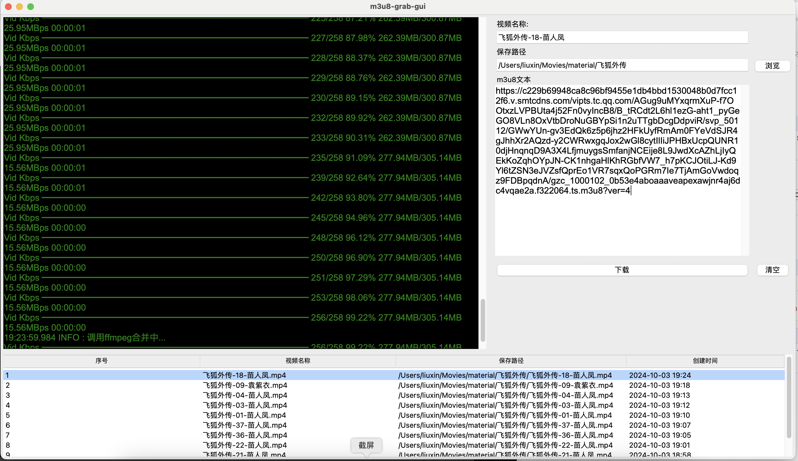

# NMRG（N_m3u8DL-RE_GUI）
## 介绍
基于[N_m3u8DL-RE](https://github.com/nilaoda/N_m3u8DL-RE)和开发的一个极简的M3U8视频下载GUI客户端。
### 运行截图
 
### 安装教程
1. 去[官网](https://ffmpeg.org/)下载并安装ffmpeg
2. 安装[N_m3u8DL-RE](https://github.com/nilaoda/N_m3u8DL-RE)并配置好环境变量
3. 在mac book **设置-隐私与安全性-安全性**  将N_m3u8DL-RE设置为 **允许** （如果没有全局允许的情况下）
4. 运行nmrg
```shell
python app.py
```
### 致谢
- [N_m3u8DL-RE](https://github.com/nilaoda/N_m3u8DL-RE)
- [ffmpeg](https://ffmpeg.org/)
